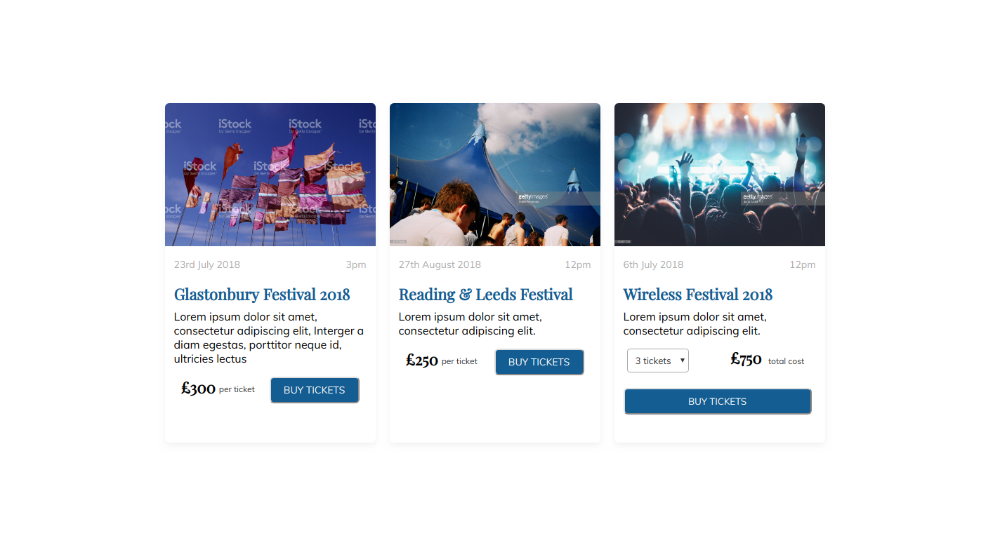
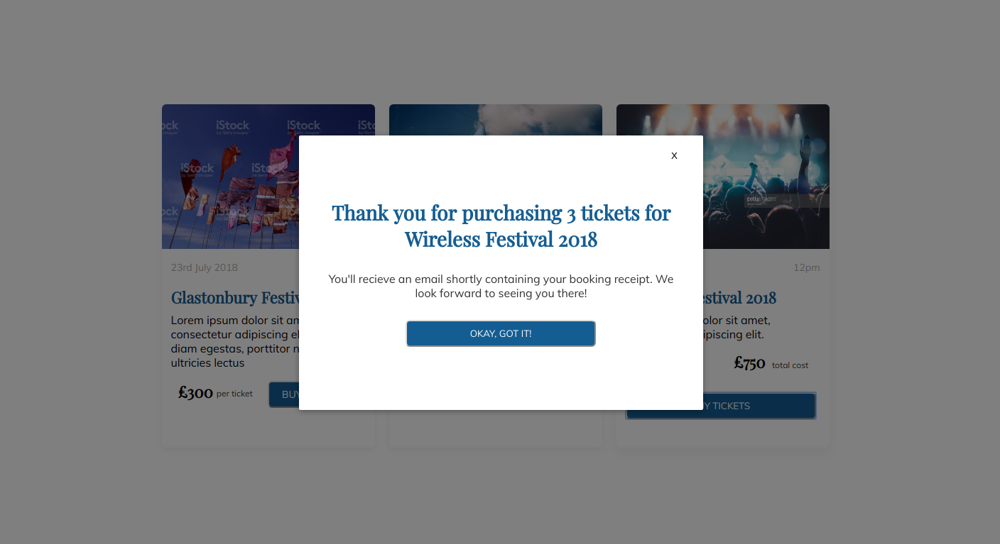

<h1>Laravel & Vue.js Festival Ticket Store</h1>

This is a app created for purchasing festival tickets using Laravel for the backend to manage the API and migrations. The frontend was created with Vue.js following the design brief. 

<h3>Desktop View </h3>

 
<h3>Mobile View </h3>

